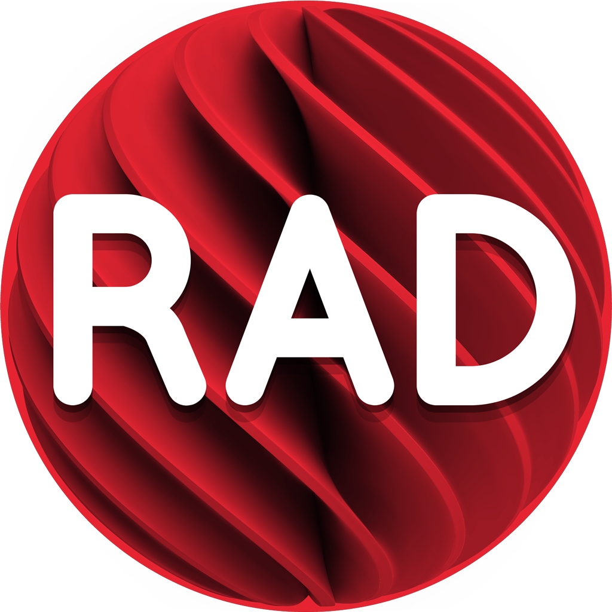
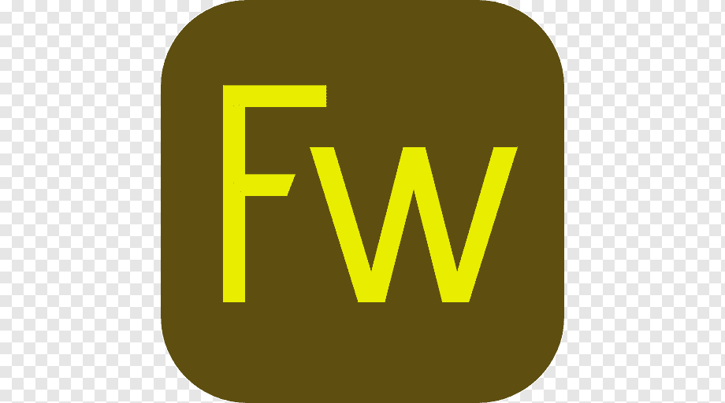

### Hello, welcome, I'm Vagner Oliveira 👋

  
<h3>About me</h3></small>

  

    :man_student: :books: I entered the software development area in 2009, after completing the technical course in computer science. I started developing in Delphi which is the main language I use. In 2018 I graduated with a bachelor's degree in Information Systems from ULBRA in Guaiba (Rio Grande do Sul, Brazil), and in 2020 I completed a postgraduate degree in Interaction Design (UX/UI).
  

  

    :computer: :writing_hand: I also like to develop websites, mainly the front-end part. I am passionate about programming, games, music and football. I'm currently working as a Delphi developer, UX/UI designer and studying Java and Kotlin for Android.
  
  

  
<h3>Sobre mim</h3></small>

  

    :man_student: :books: Entrei na área de desenvolvimento de software no ano de 2009, após concluir o curso técnico de informática. Comecei a desenvolver em Delphi que é a principal linguagem que utilizo. Em 2018 me formei bacharel em Sistemas de Informação pela ULBRA de Guaiba(Rio     Grande do Sul, Brasil), e em 2020 concluí pós gradução em Design de Interação (UX/UI). 
  

  

    :computer: :writing_hand: Também gosto de desenvolver websites, principalmente a parte de front-end. Sou apaixonado por programação, jogos, música e futebol. Atualmente estou atuando como desenvolvedor Delphi, UX/UI designer e estudando Java e Kotlin para Android. 
  

  
<h3>Languages</h3></small>

    
  
  
  
  

  
<h3>Databases</h3></small>

    
  
    

  
<h3>Development Tools</h3></small>

    
  
  
  

  
<h3>UX & UI Tools</h3></small>

    
  
  
  

  
<h3>Contact</h3></small>

  
 
  
  
   

  
<h3>Stats</h3></small>

  <!-- STATS:START -->
<table>
<tr>  
  <td colspan="3">
    

      
    

  </td>
</tr>  
<tr>
  <td>
    

      
    

  </td>
  <td>    
    

      
    
 
  </td>  
</tr>
<tr>
  <td colspan="3">
    

      
    
   
  </td>  
</tr>
</table>
<!-- STATS:END -->

  

