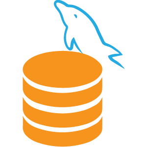
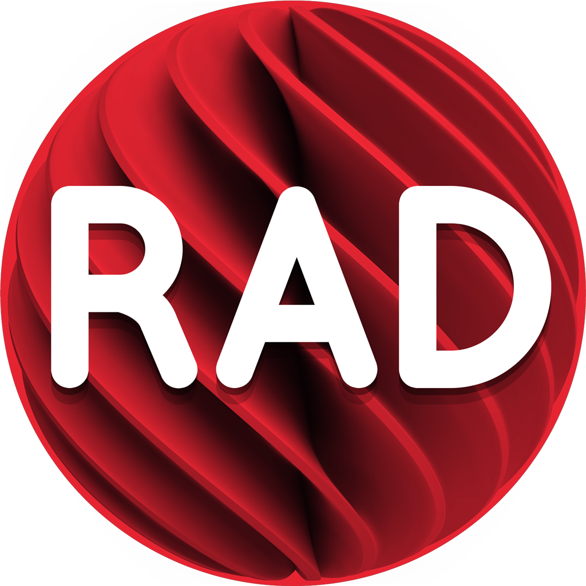
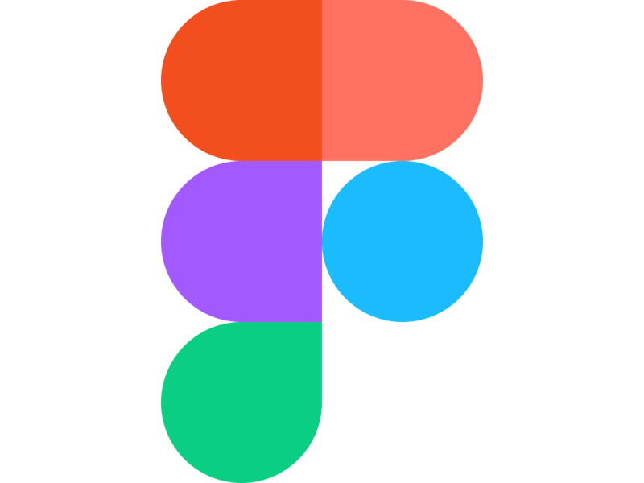
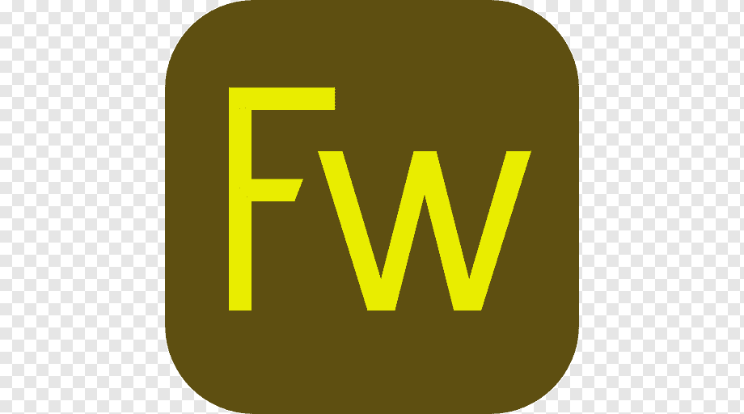

### Hello, welcome, I'm Vagner Oliveira 👋

  
<h3>About me</h3></small>

  

    Hello! 👋 I'm Vagner Oliveira, a programming and technology enthusiast. Welcome to my profile!
  

  

    My journey in the field of Information Technology began in 2009 when I completed my Technical Course in Informatics. Interestingly, my initial goal was to learn about hardware, but in the second semester, I was introduced to the fascinating world of programming—and it was love at first sight. From that moment on, I knew I wanted to become a developer.
  

  

    Later in 2009, I started my professional career and had my first experience with the Delphi language, which became my specialty. Over the years, I expanded my knowledge, and in 2018, I earned a Bachelor's degree in Information Systems from ULBRA (Guaíba - RS Campus). Seeking a deeper understanding of user experience and interface design, I completed a postgraduate degree in Interaction Design (UX/UI) at IGTI in 2020.
  

  

    In addition to my expertise in Delphi, I also have experience with JavaScript, HTML, CSS, and SQL, focusing on enhancing my front-end web development skills.
  

  

  
<h3>Sobre mim</h3></small>

  

    Olá! 👋 Sou Vagner Oliveira, um entusiasta da programação e da tecnologia. Seja muito bem-vindo(a) ao meu perfil!
  

  

    Minha jornada na área de Tecnologia da Informação começou em 2009, quando concluí o Curso Técnico de Informática. Curiosamente, meu interesse inicial era aprender sobre hardware, mas no segundo semestre fui apresentado ao fascinante mundo da programação – e foi paixão à primeira vista. Desde então, decidi que queria me tornar programador.
  

  

    Ainda em 2009, dei início à minha carreira profissional e tive meu primeiro contato com a linguagem Delphi, que se tornou minha especialidade. Com o passar dos anos, ampliei meus conhecimentos e, em 2018, me formei como Bacharel em Sistemas de Informação pela ULBRA (Campus Guaíba - RS). Em busca de uma compreensão mais profunda sobre experiência do usuário e design de interfaces, finalizei, em 2020, uma pós-graduação em Design de Interação (UX/UI) pelo IGTI.
  

  

    Além da minha expertise em Delphi, também possuo conhecimento em JavaScript, HTML, CSS e SQL, com foco no aprimoramento das minhas habilidades em desenvolvimento front-end web.
  

  
<h3>Languages</h3></small>

    
  
  
  
  

  
<h3>Databases</h3></small>

    
  
    

  
<h3>Development Tools</h3></small>

    
  
  
  

  
<h3>UX & UI Tools</h3></small>

    
  
  
  

  
<h3>Contact</h3></small>

  
 
  
  
   
  
    

  
<h3>Stats</h3></small>

  <!-- STATS:START -->
<table>
<tr>  
  <td colspan="3">
    

      
    

  </td>
</tr>  
<tr>
  <td>
    

      
    

  </td>
  <td>    
    

      
    
 
  </td>  
</tr>
<tr>
  <td colspan="3">
    

      
    
   
  </td>  
</tr>
</table>
<!-- STATS:END -->

  

